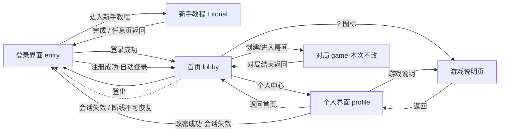

# 《潮汐商会》页面结构与 UI 改版策划案 v1.0

> 依据：`tests/page_flow_analysis.md`（测试PM 分诊报告）、`docs/01_rulebook_v1.0.md`、`docs/10_new_player_tutorial_v1.0.md`、`docs/04_art_direction.md`、`docs/05_ui_spec.md`。
> 本方案只定义产品行为、页面流转与视觉规范，不修改 `shared/`、`client/`、`server/`，不包含代码实现。
> UI 参考《锚点降临》的色调与气质（二次元科幻、深海蓝/青蓝冷色、深色背景+霓虹高光），**所有素材必须原创或以纯 CSS 实现，不使用任何外部版权图片/字体**。

---

## 1. 页面结构定义

### 1.1 界面正式命名

| # | 正式命名 | 英文标识（建议 screen 值） | 一句话定位 |
|---|---|---|---|
| P1 | **登录界面** | `entry` | 未认证用户的常驻入口：登录 / 注册 / 新手教程 |
| P2 | **新手教程** | `tutorial` | 三页文本引导，从登录界面进入，读完返回登录界面 |
| P3 | **首页** | `lobby` | 登录后的主界面：开房 / 进房 / 看在线房间，通往个人界面 |
| P4 | **个人界面** | `profile` | 个人信息、密码修改、游戏说明 |

对局界面（`game`）不在本次改版范围，保持现状。

### 1.2 各界面功能清单

#### P1 登录界面（entry）
- 主功能按钮三枚：**登录**、**注册**、**新手教程**（均打开对应模态框或页面）。
- 登录/注册模态框：支持登录↔注册切换；注册含确认密码。
- 登录/注册失败的错误提示**显示在模态框内**（规范见 §3.4），不跳屏。
- 视觉：全屏深海背景 + 游戏 Logo/标题（「潮汐商会」）+ 一句世界观短文案（见 §5.1）。
- 不出现：服务器地址输入、游客入口、任何房间功能。

#### P2 新手教程（tutorial）
- 三页文本（沿用现有 tutorial 三页内容，文案微调见 §5.2），支持翻页（上一步/下一步）与随时「返回登录」。
- 第三页按钮为「完成」，点击后**返回登录界面**。
- 全程纯客户端，不发送业务协议；任何身份均可阅读（无需登录）。

#### P3 首页（lobby）
- 主功能：**创建房间**、**进入房间**（房间码输入）、**查看在线房间**（列表 + 刷新）。
- **右上角固定区**：账号名标识 + **登出按钮** + 小型「?」游戏说明图标（次级入口，见 §3.3 决策 D3）。
- **进入个人界面**入口：显著按钮「个人中心」。
- 排行榜入口保留（次级按钮，见 §3.3 决策 D6）。
- 不出现：新手教程入口、服务器地址调试行（迁移决策见 §3.3 D7）、战绩弹层（并入个人界面）。
- 房间内时不允许登出（现有保护保留）。

#### P4 个人界面（profile）
- **个人信息展示**：账号名、战绩摘要（总局数/胜场/胜率/场均分，复用 `get_my_stats`，无需新增协议）。
- **密码修改**：表单规则见 §3.5。
- **游戏说明**：打开常驻规则文档页（文案见 §5.3），可返回个人界面。
- **返回首页**按钮（左上角返回箭头 + 按钮双保险）。

### 1.3 页面流转图

### 1.4 返回路径完整清单（验收口径）

| 路径 | 决策 |
|---|---|
| 教程任意页「返回」/ 第三页「完成」 | → 登录界面（entry） |
| 个人界面「返回首页」 | → 首页（lobby） |
| 游戏说明「返回」 | → 回到来源页（个人界面或首页，记录入口来源） |
| 首页「登出」 | → 登录界面（entry） |
| 会话失效（session authenticated=false） | → 登录界面（entry），toast「登录已过期，请重新登录」 |
| 密码修改成功 | 旧会话全部失效 → 提示后回登录界面（见 §3.5） |
| 登录/注册失败 | 停留登录界面，模态框内提示，不跳屏 |
| 持有效 session 打开站点 | 直接进首页（跳过登录界面），此行为保留不回归 |

---

## 2. 查漏补缺：差距清单逐项决策

对应 tests/page_flow_analysis.md §2 差距表（G1-G9）与 §4 遗漏点：

| 差距 | 决策 | 编号 |
|---|---|---|
| G1 教程完成后停在注册引导页 | 教程「完成」→ 返回登录界面。完成页保留一枚可选按钮「注册账号」作为弱引导，主按钮为「完成，返回登录」 | D1 |
| G2 登出后停在游客流 | 登出成功 → `entry` | D2 |
| G3 登录界面仅首访出现 | 见 §3.1 | D3 |
| G4 登出按钮位置 | 首页右上角固定（账号名 + 登出图标按钮），账号状态标识保留 | D4 |
| G5 个人界面缺失 | 新增 `profile`，功能清单见 §1.2 P4 | D5 |
| G6 游戏说明与教程关系 | 见 §3.3 | D6 |
| G7 登录失败提示落点 | 模态框内联错误提示，见 §3.4 | D7 |
| G8 首页调试元素 | 服务器地址行从首页移除，改为仅在 URL 带 `?debug=1` 时于登录界面底部显示 | D8 |
| G9 战绩/排行榜入口归属 | 「我的战绩」并入个人界面（个人信息展示区）；排行榜保留首页次级入口 | D9 |
| 遗漏1 游客身份去留 | **移除游客入口**。登录界面只保留 登录/注册/新手教程 三项；教程为纯文本阅读，不需要游客身份。与 docs/10 §1.1「游客不能进入大厅」口径一致 | D10 |
| 遗漏6 首访标记 | `tides_entry_seen` 逻辑**移除**，不另作他用（教程不做自动播放） | D11 |
| 服务端协议需求 | 需新增 `change_password`（见 §3.5）；个人信息复用 `get_my_stats`，**不新增 `get_account_info`** | D12 |

---

## 3. 关键产品决策详述

### 3.1 登录界面常驻化（决策 D3）

- **移除首访标记逻辑**（`tides_entry_seen` 废弃）：登录界面是**常驻入口**，不再是"首次访问一次性页面"。
- 判定规则简化为：**未认证 → 一律落在登录界面**（打开站点、登出后、会话失效后、教程完成后）；**持有效 session → 直接进首页**。
- 登录界面不做"已登录自动跳过"以外的任何记忆逻辑。

### 3.2 统一回登录界面（决策 D2）

以下事件全部收敛到登录界面，文案统一为 toast + 落屏：
1. 主动登出（成功）——toast「已登出」；
2. 会话失效/过期——toast「登录已过期，请重新登录」；
3. 密码修改成功——toast「密码已修改，请使用新密码重新登录」；
4. 教程完成/退出——无 toast。

### 3.3 「游戏说明」与「新手教程」关系（决策 D6）

**两者是不同内容、不同入口，不互相复用页面：**

| | 新手教程 | 游戏说明 |
|---|---|---|
| 定位 | 首次接触的三页快速引导（是什么/怎么玩/怎么赢） | 常驻完整规则文档（规则书浓缩版，可随时查阅） |
| 内容 | 三页短文（§5.2） | 全文（§5.3，基于 docs/01 规则书浓缩） |
| 入口 | **仅登录界面** | **个人界面（主入口）+ 首页右上角「?」图标（次入口）** |
| 出口 | 返回登录界面 | 返回来源页 |
| 登录后是否主动出现 | 否（不自动播放，无首访标记） | 否 |

- 首页现有的「查看规则 / 重玩教学」按钮统一替换为「?」图标，**打开游戏说明页而非教程**；登录后不再提供教程入口（教程内容已被游戏说明完整覆盖）。
- 两处文案分开维护：教程讲"体验路径"，说明讲"完整规则"，不存在内容重复问题。

### 3.4 登录/注册失败提示规范（决策 D7）

- **落点**：错误提示渲染在登录/注册模态框**内部顶部**（表单上方红字条），不使用仅 lobby 可见的 accountNotice，不依赖 toast 单一通道（toast 可同时出现作为辅助）。
- **不跳屏**：失败停留在登录界面，模态框保持打开。
- **表单保留**：账号名输入保留不清空；密码字段清空待重输。
- **文案**（沿用现有错误码映射，统一措辞）：
  | 场景 | 提示文案 |
  |---|---|
  | 账号不存在或密码错误 | 「账号名或密码错误」 |
  | 账号已存在（注册） | 「该账号名已被注册」 |
  | 账号名格式错误 | 「账号名需 3-64 位，仅限字母、数字、下划线、连字符」 |
  | 密码格式错误 | 「密码需 8-256 位」 |
  | 两次密码不一致 | 「两次输入的密码不一致」 |
  | 断线/超时 | 「网络异常，请稍后重试」 |
- 前端校验不通过时**不发送请求**，直接内联提示；服务端拒绝时以服务端错误码为准。

### 3.5 密码修改表单规则（决策 D12）

表单字段：旧密码、新密码、确认新密码。

| 规则 | 校验 | 失败提示 |
|---|---|---|
| 旧密码必填 | 非空 | 「请输入当前密码」 |
| 旧密码正确性 | 服务端校验，错误码 `wrong_old_password` | 「当前密码错误」 |
| 新密码长度 | 8-256 位（与注册规则一致） | 「新密码需 8-256 位」 |
| 两次一致 | 新密码 = 确认新密码 | 「两次输入的密码不一致」 |
| 新旧不同 | 新密码 ≠ 旧密码（前端预检 + 服务端兜底） | 「新密码不能与当前密码相同」 |
| 频率限制 | 每分钟最多 3 次尝试（服务端限流） | 「操作过于频繁，请稍后再试」 |

**成功后行为**：提示「密码已修改，请使用新密码重新登录」→ **服务端使该账号全部 session 失效（含当前会话）**→ 客户端回登录界面。

**协议需求（提请主协调同步 shared/protocol.md）**：
- 新增 `change_password {old_password, new_password}` → 响应 `password_changed` 或 `error{code}`；
- 新增错误码 `wrong_old_password`（复用现有格式/限流错误码）；
- 改密成功即全部 session 失效的安全策略写入协议说明。

---

## 4. UI 视觉规范（深海科幻 · 纯 CSS 可实现）

### 4.1 设计基调

参考《锚点降临》气质：**深海蓝/青蓝冷色调、近黑深蓝背景、霓虹青色高光、细描边科技面板**。关键词：深潜、全息、冷光。本规范**全部以 CSS 渐变/阴影/边框实现，不引入任何图片与外部字体**，规避版权风险。

> 注意：本套配色为站点框架（登录/首页/个人/教程四屏）专用；对局内的潮位状态色、货物识别色继续沿用 `docs/04_art_direction.md` §2.2/§2.3，二者以"框架冷色 / 对局语义色"分层，互不覆盖。

### 4.2 配色 Token 表

| Token | 值 | 用途 |
|---|---|---|
| `--bg-abyss` | `#040B16` | 页面最底层底色（近黑深蓝） |
| `--bg-deep` | `#081527` | 渐变中层 |
| `--bg-panel` | `rgba(13, 32, 56, 0.72)` | 卡片/面板底（配 `backdrop-filter: blur(8px)`） |
| `--bg-panel-solid` | `#0D2038` | 不透明面板（模态框） |
| `--neon-cyan` | `#3DE8E0` | 主强调：主按钮、高亮描边、可交互元素 |
| `--neon-blue` | `#4F8CFF` | 次强调：链接、次级按钮、信息态 |
| `--neon-violet` | `#7C6CFF` | 点缀色（徽章、稀有提示，克制使用） |
| `--text-primary` | `#E8F2F8` | 主文字（近白冷调） |
| `--text-secondary` | `#8FA8BF` | 次级文字/说明 |
| `--text-disabled` | `#4A5E73` | 禁用态 |
| `--danger` | `#FF5D6C` | 错误/警示（霓虹红） |
| `--success` | `#3DE8A8` | 成功/正向反馈 |
| `--line` | `rgba(61, 232, 224, 0.28)` | 默认描边（1px） |
| `--line-strong` | `rgba(61, 232, 224, 0.6)` | 激活/hover 描边 |
| `--glow-cyan` | `0 0 12px rgba(61,232,224,.35)` | 发光阴影（按钮 hover、强调卡片） |

### 4.3 各界面背景方案（纯 CSS）

统一基底：`linear-gradient(180deg, var(--bg-deep), var(--bg-abyss))` 上叠 2-3 层 radial-gradient 冷光斑。各屏差异：

| 界面 | 背景方案 |
|---|---|
| 登录界面 | 顶部偏左大光斑 `radial-gradient(ellipse at 30% 0%, rgba(61,232,224,.14), transparent 60%)` + 底部深海光斑（neon-blue 8%）；可选叠加 `repeating-linear-gradient` 细网格线（透明度 0.03）营造科技感 |
| 首页 | 弱化版基底（光斑透明度减半），避免干扰列表阅读；右上角登出区可加微弱 cyan 辉光 |
| 个人界面 | 同首页基底；顶部个人信息卡片背后加一条横向青色渐变光带（1-2px，`linear-gradient(90deg, transparent, var(--neon-cyan), transparent)`，透明度 0.4） |
| 新手教程 | 最简基底，仅保留底层渐变，保证长文可读性 |
| 游戏说明 | 同教程 |

禁止：动态粒子/视频背景（性能与首屏要求）；任何位图背景。

### 4.4 组件风格

| 组件 | 规格 |
|---|---|
| 卡片/面板 | 圆角 12px；底色 `--bg-panel` + 毛玻璃 blur(8px)；1px 描边 `--line`；hover 时描边转 `--line-strong` + `--glow-cyan` |
| 主按钮 | 圆角 8px；填充 `linear-gradient(135deg, var(--neon-cyan), var(--neon-blue))`，文字 `#04101F` 加粗；hover 加 `--glow-cyan`；disabled 退化为 `--text-disabled` 描边样式 |
| 次按钮 | 圆角 8px；透明底 + 1px `--line` 描边 + `--text-primary`；hover 描边加亮 + 背景 `rgba(61,232,224,.08)` |
| 危险按钮（登出） | 透明底 + `--danger` 描边与文字；hover 时 `rgba(255,93,108,.12)` 底 |
| 输入框 | 圆角 8px；底 `rgba(4,11,22,.6)`；1px `--line`；focus 描边 `--neon-cyan` + 内发光 `inset 0 0 8px rgba(61,232,224,.15)`；占位文字 `--text-disabled` |
| 错误提示条 | `rgba(255,93,108,.12)` 底 + 左侧 3px `--danger` 竖条 + `--danger` 文字 |
| Toast | `--bg-panel-solid` 底 + 1px `--line`，成功/错误分别用 `--success`/`--danger` 左竖条 |
| 断线横幅 | 保持现有结构，配色换 `--danger` 系 |

### 4.5 字体建议

系统字体栈，不引入外部字体：
`font-family: "PingFang SC", "Microsoft YaHei", "Noto Sans CJK SC", "Segoe UI", system-ui, sans-serif;`
- 标题：加粗 + 字距 0.05em + 可选 cyan 文字阴影 `0 0 16px rgba(61,232,224,.5)` 模拟霓虹；
- 数字/房间码：等宽兜底 `ui-monospace, Consolas, monospace`；
- 正文 14px / 行高 1.6，次级说明 12-13px。

### 4.6 可读性底线（验收用）

- 正文文字与背景对比度 ≥ 4.5:1（`--text-primary` on `--bg-abyss` 满足）；
- 1366×768 与 1920×1080 下无破版；按钮 hover/disabled/focus 三态肉眼可区分；
- 发光效果只做"辉光"不做"闪烁"，避免光敏不适。

---

## 5. 文案

### 5.1 登录界面

- 主标题：**潮汐商会**
- 副标题（世界观短句）：「潮起潮落之间，唯有借势者赢得群岛。」
- 按钮：登录 / 注册 / 新手教程

### 5.2 新手教程三页（微调稿）

- **第 1 页 · 这是什么**：你是潮汐群岛四大商会的船长。四个轮回里，驾船穿梭于东鳞港、碎星礁、雾门与白汐城之间，低买高卖、交付订单、设立商站。四轮之后，财富与声望最高的商会获胜。
- **第 2 页 · 一张牌三种用法**：每回合你打出一张手牌，三选一——① 执行卡牌行动（扬帆、交易、交付、设站、秘术、顺风）；② 留存为货物，拿去卖钱或交付订单；③ 弃置推动潮汐，改变所有人的航行费与价格。
- **第 3 页 · 怎么赢**：订单给 VP 和金币，商站在终局按港口多数计分，剩余货物与金币也折算成分。盯紧潮位：涨潮交付多得分，满潮航行免费、卖货加价。总分最高者胜。
- 第三页按钮：「完成，返回登录」（主）、「注册账号」（次）。

### 5.3 游戏说明（完整文案，基于 docs/01 规则书浓缩）

**《潮汐商会》游戏说明**

**一、游戏目标**
2-4 名玩家扮演潮汐群岛的商会船长，进行 4 轮 × 3 回合（共 12 回合）的贸易竞争。终局总分最高者获胜。

**二、开局**
每人 5 张手牌、3 金币，船停在东鳞港。公开 3 张订单，每人再秘密获得 1 张隐藏订单。市场初始价格：盐鳞 3、灯油 3、丝贝 4。潮汐从「涨潮」开始。

**三、每回合做什么**
1. **选牌（45 秒）**：所有人同时选 1 张手牌并声明用途。超时未选，系统自动将第 1 张手牌以「推潮」打出。
2. **结算**：按座位顺序依次结算，随后推进潮汐、触发事件、每人补 1 张牌。

**四、卡牌的三种用途**
- **行动**：执行卡牌行动面（见下）。
- **存货**：放入货物仓，变成对应货物；万用货物（wild）可充当任意货物。
- **推潮**：弃置卡牌，按潮纹值推进公共潮汐轨道（wild 潮纹为 0，不推进）。

**五、六种行动**
- **扬帆**：付航行费（基础 1 金币）移动到相邻港口，四港成环。
- **市集交易**：买货（一次最多 2 件同种，每件买入后价格 +1）或卖货（固定 1 件，卖出后价格 -1）。
- **交付订单**：交出订单所需全部货物，获得 VP 与金币；订单涉及的每种货物价格 -1。
- **设立商站**：付 2 金币在当前港口放 1 枚商站，每港每人限 1 枚，不可移动。
- **潮汐秘术**：二选一——窥探事件堆顶，或将潮汐轨道前进/后退 1 格。
- **顺风**：先扬帆到相邻港，再在新港追加一次交易（全牌库仅 4 张）。

**六、潮汐四档（循环：低潮→涨潮→满潮→退潮）**
| 潮位 | 效果 |
|---|---|
| 低潮 | 航行费 +1；买货每件 -1（最低 1） |
| 涨潮 | 交付订单额外 +1 VP |
| 满潮 | 航行免费；卖货每件售价 +1（可突破价格上限） |
| 退潮 | 航行费 +1；交付隐藏订单额外 +1 VP |

潮汐进入新档位时触发对应事件（如暗礁每人 -1 金币、商队启程每人 +1 金币、海雾无事发生等）。

**七、市场**
三种货物价格区间 1-6，越界会被钳制。买货抬价、卖货与交付压价，价格变动在当笔结算之后生效。

**八、订单**
公开订单 3 张，先交先得，不补新单；隐藏订单仅本人可见，交付时公开。万用货物可替代任意货物。订单在任意港口均可交付。

**九、商站与终局计分**
终局按四港商站数量结算多数分：第 1 名 4 分、第 2 名 2 分、第 3 名 1 分；并列平分（向下取整）。
总分 = 订单 VP + 商站多数分 + 剩余货物每件 1 分（上限 5）+ 金币每 3 枚换 1 分（上限 4）。
平分依次比较：订单 VP → 商站分 → 金币 → 共享胜利。

**十、断线与超时**
选牌超时自动推潮第 1 张手牌；断线 60 秒内可重连恢复，不会阻塞其他玩家。

---

## 6. 移交事项

1. **主协调**：同步 `shared/protocol.md`——新增 `change_password`/`password_changed`/错误码 `wrong_old_password`；写明"改密成功全部 session 失效"策略；`get_account_info` 本期不做。
2. **后端 agent**：实现 `change_password`（旧密码校验、新密码规则、限流、全 session 失效）+ eunit 用例。
3. **前端 agent**：按 §1 页面结构与 §4 视觉规范实施；移除 `tides_entry_seen` 与游客入口；登出/会话失效/改密成功统一回 entry；错误提示落模态框内。
4. **测试PM**：按 tests/page_flow_analysis.md §5 验收清单 + 本文 §1.4 返回路径表回归，改版后同步更新既有 UI 静态验收文档。
